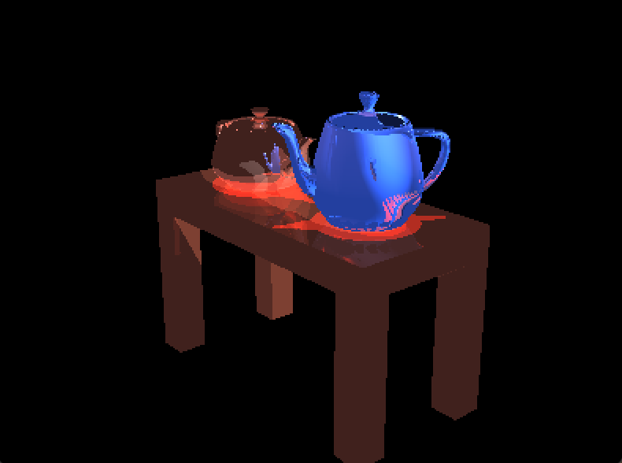
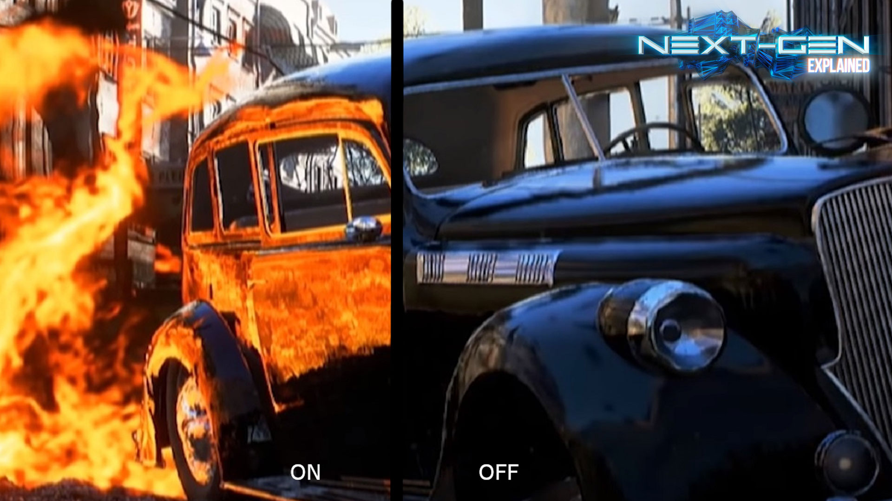

# CPU-based Raytracer
<p align="center">

</p>

## Introduction to Ray Tracing
To understand the Raytracing technique in computer graphics, 
we should first be clear about the difference between images captured by 
cameras and human eyes and images generated by computers. 
Cameras and human eyes, the most powerful biological cameras, 
**record** the scene in our surroudings into a 2D image. But for computers, only geometric data
(including shape, mateiral paramters, location, etc.) are available, 
the goal is to **paint** this image as similar to the camera photo as possible. 
This is called photorealism.

Raytracing is an efficient technique to achieve photorealism in computer graphics.
Without raytracing, the difference between a computer-generated image and a camera photo 
can be attributed to local illumination: the most basic rendering framework calculates 
the color and brightness of a small region with only light paramters and paramters of this region.
But in the real world, lights can be reflected and refracted among objects and different parts of 
an object. As the name suggests, a raytracer traces the lights among regions and achieves global 
illumination, as opposed to local illumination. Now the color and brightness of a region are determined by 
the direct lights and light rays by its surroudings regions/objects. 

This image by NVIDIA can illutrate the difference well.  



## System/Framework Design
The followings are essential class definitions in the framework. 
For design and implementation details, please read the code and in-line comments.
- Triangle: each object is represented by many triangles, contains vertices position, vertex normal directions, and material information
- Scene: container for geometries, lights, etc.
- Image: container for pixel colors, info of width and height
- Ray: position and direction, to mimic or anti-trace the light
- Intersection: geometry (Triangle) info and ray info if a ray intersect with a Triangle

And here is the overall framework (pseudocode): 

```
function Raytrace(camera, scene, image) {
    for each pixel position (i,j):
        Ray ray =  RayThruPixel(cam, i, j);
        Intersection hit = Intersect( ray, scene );
        image.pixel[i][j] = FindColor( hit, scene );
}
```

## Functions/Algorithms Explanation
- RayThruPixel(camera, i, j)
Shoot a ray from camera through the **center** of (i,j)-th pixel.  
The key is to turn the position (i,j) ranging from (0,0) to (height-1, width-1) 
in the index space into normalized device coordinate (NDC),
which ranges from (-1,-1) to (1,1), bottom-left to top-right.    
Define: $\alpha=2 \cdot \frac{i+0.5}{width}-1$, $\beta=1-2\cdot \frac{j+0.5}{height}$.  
$(\alpha, \beta)$ is the pixel in NDC. After some derivations
the ray direction (before normalization) in the world coordinate is given by the following: 
$$(\alpha \cdot asp \cdot \tan(fovy/2)u + \beta \cdot \tan(fovy/2)v - w)$$
where asp is the aspect ratio = width/height; u,v,w are camera basis represented in world coordiante;
fovy is field of view angle.

- Intersect( ray, scene )  
Given a ray, find the **first** hit of it with the scene, and **first** means the hit with shortest distance to camera. This function simply traverses all the triangles* in the scene, calls helper function that returns the ray-triangle Intersection, and compare the distance. 

- Intersect (triangle, scene)
All the magic boils down to solving $t, \lambda_1, \lambda_2, \lambda_3$ in the following linear system:  
$$q = p_0 + t\cdot d $$ 
$$q = \lambda_1p_1 + \lambda_2p_2 + \lambda_2p_2$$
$$\lambda_1 + \lambda_2 + \lambda_3 = 1$$
where q is hit position, $p_0, p_1, p_2, p_3$ are ray starting point and 3 vertices of the triangle, d is ray direction, t is distance, and $\lambda_1, \lambda_2, \lambda_3$ are the barycentric coordinates of q w.r.t this triangle.  
At last, if all $t, \lambda_1, \lambda_2, \lambda_3 \geq 0$, there is an Intersection. Otherwise the ray shoots to infinity.

- FindColor( hit, scene )  
This function find the color filling a single pixel given the hit (of class Intersection). Note that it needs to handle no-hit case by checking hit.distance and returns background color (black:0,0,0). 
```cpp
if no-hit: return (0,0,0)
color = emision
for each light:
    // find shadow effect 
    find ray2light; // shoot another ray from hitting position to light
    hit_light = Intersect(ray2light, scene);
    visibility = (hit_light.distance<inf)? true:false;
    color += diffuse_contribution * visibility;

    // recursive call: ray-tracing at core
    find ray2; // mirror reflected ray
    hit2 = Intersect(ray2light, scene);
    color += specular_coeff * FindColor(hit2, scene);

return color
```
## About Color: Blinn–Phong Reflection Model
This section contains a more in-depth introduction of the Blinn–Phong Reflection Model our FindColor() method based on. If you are interested in the formula and all the details behind, the [Wikipedia page](https://en.wikipedia.org/wiki/Blinn%E2%80%93Phong_reflection_model) is a good place to start.  
Blinn–Phong Reflection Model is a local-illumination model. It makes slight computation improvement on top of the famous Phong Refection Model. They share the same idea.  
Essentially, the color of a point on an object we see, say a teapot, is determined by all the light sources and the material of this teapot. The light property of any material can be broken down into the following: 
- emission (light-independent): intrincic light
- ambient: accounts for small amount of light scattered around
- diffuse: accounts for random-direction reflection light
- specular: accounts for mirror-like reflection light


Image by [Brad Smith](https://commons.wikimedia.org/w/index.php?curid=1030364) - Own work, CC BY-SA 3.0

In particular, the RGB color we see = emission + sum of contribution from (ambient, diffuse, specular) over all lights.  
But remember this is a local-illumination model. When a point of interest can reflect diffuse and specular light rays out, it likely will also receive diffuse and specular light rays from other objects in the scene. In a basic version raytracer, the specular part will be replaced by recursive color finding. A more advanced raytracer will also replace the diffuse part. A recursive diffuse part is much more difficult because we need several rays to shoot through a single pixel and reflect to random directions. This increases the implmentation diffuclty and computation cost.

## Authors

- [@thomaswang0822](https://github.com/Thomaswang0822)

<script
  src="https://cdn.mathjax.org/mathjax/latest/MathJax.js?config=TeX-AMS-MML_HTMLorMML"
  type="text/javascript">
</script>